<h3><code>suhas@github ~ $ ./contributions.sh</code></h3>

  

<h3><code>suhas@github ~ $ whoami</code></h3>
<table>
  <tr>
    <td valign="top"></td>
    <td valign="top"></td>
  </tr>
</table>

 

---

 

  

 

 

**`📍 Malmo, Sweden`** &nbsp; **`🟢 Open to Remote & Relocation`**

 

---

### 👋 &nbsp;About Me

I build production-ready AI systems using Generative AI, RAG pipelines, and multi-agent LLM architectures.  
Developed scalable applications with LangChain, FastAPI, and cloud platforms (AWS/GCP).  
Improved model performance and reliability — boosting recommendation relevance by 38% and achieving 0.92 F1-score in predictive systems.  
Focused on delivering efficient, real-world solutions with MLOps, automation, and intelligent data pipelines.

 

---

## 🧠 &nbsp;Tech Stack

**AI / ML**

 

**Frameworks & Tools**

 

**Cloud & DevOps**

 

**Data Engineering**

 

---

### 🚀 &nbsp;Featured Projects

 

<table>
<tr>
<td width="52%" valign="top">

#### &nbsp;🎬 AI-Powered Movie Recommendation System

Developed a recommendation system using collaborative filtering enhanced with LLM-based explanations. Integrated LangChain with Llama 3 to generate personalized natural language insights. Optimized retrieval using vector search, improving recommendation relevance by 38% and reducing hallucinations by 78%. Deployed as a FastAPI service with sub-1.2s response time.

**→ [View Repository](https://github.com/suhaskosari/Movie-Recommendation-System-with-AI-Generated-Explanations)**

</td>
<tr>
<td width="52%" valign="top">

#### &nbsp;🔬 Multi-Agent Research Assistant

Autonomous research agent that browses the web, searches ArXiv papers, executes code, and remembers context across sessions. Built with LangGraph state machine, FastAPI SSE streaming, and visible reasoning trace in real time.

**→ [View Repository](https://github.com/suhaskosari/research-agent)**

</td>
</tr>
</table>

 

---

### 🎯 &nbsp;Open to Opportunities

Looking for **AI Engineer** and **Machine Learning Engineer** roles — building production-ready LLM applications, RAG pipelines, and scalable AI systems with MLOps and cloud deployment.

 

&nbsp;

  

*If any of my work helped you — a ⭐ on the repo goes a long way.*

